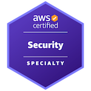

### Welcome 👋

I enjoy building solutions on **Amazon Web Services (AWS)** that strengthen threat detection and reduce the time required to respond to security incidents. In today’s rapidly evolving cybersecurity landscape, access to strong security capabilities shouldn’t be a barrier to entry.

As a member of the **AWS Community Builders Program** since **March 2022**, and holder of the **AWS Certified Security – Specialty** certification since **December 2022**, I focus on sharing knowledge and contributing to open-source projects that make security more accessible to everyone.

I contribute to **open-source security** and **digital forensics** tooling, primarily using the **AWS Cloud Development Kit (CDK)** in **Python**, as well as **Rust** for high-performance components and **Jupyter Notebook** for analysis and exploration. My goal is to help anyone understand what happened in their environment—because we all rely on the same data to investigate incidents, uncover root causes, and protect our systems, even if we apply that data in different ways.

